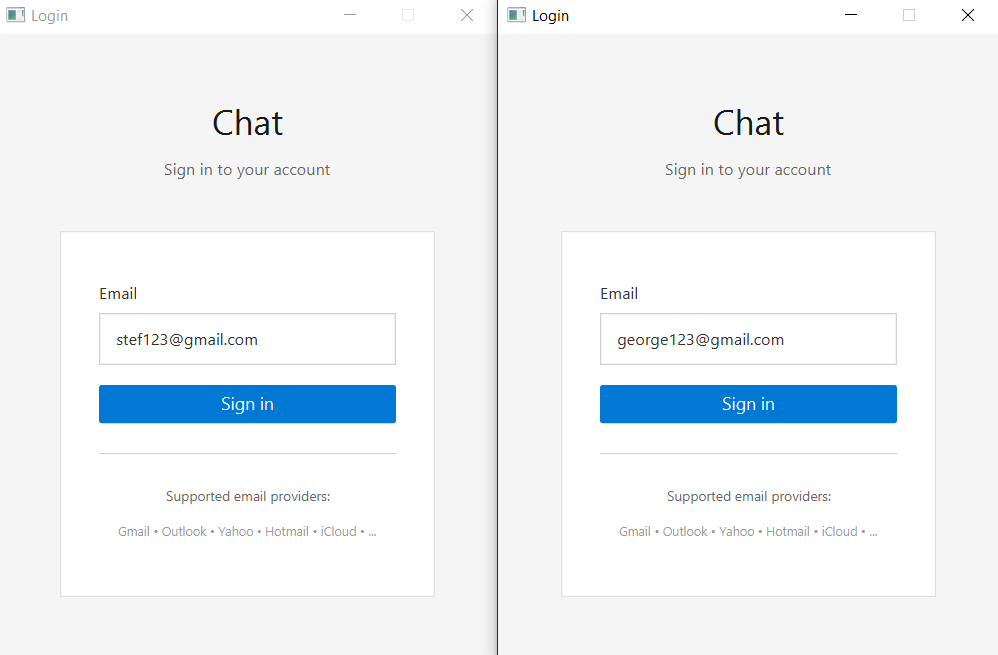
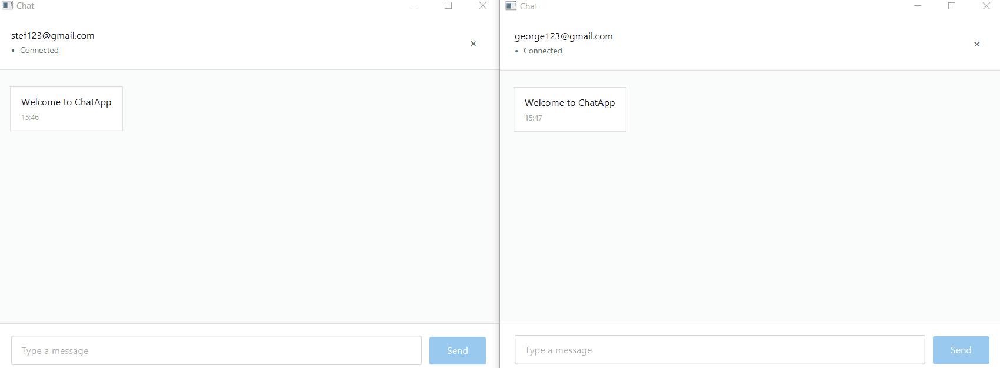

# Simple TCP Socket Chat App

A multi-client TCP chat application built with Java and JavaFX. It features a threaded server that broadcasts messages to all connected clients and a clean GUI with a login screen and a real-time chat window.

## Demo

| Login Screen | Chat Window |
|---|---|
|  |  |

## Features

- **TCP server** — listens on a configurable port and accepts up to a configurable number of simultaneous clients via a fixed thread pool
- **Message broadcasting** — every message sent by one client is relayed to all other connected clients in real time
- **JavaFX GUI** — login screen and chat window built with FXML; no console required for end users
- **Email-based login** — validates email format and restricts sign-in to common providers (Gmail, Outlook, Yahoo, Hotmail, iCloud, ProtonMail, AOL)
- **Chat bubbles** — outgoing messages are right-aligned (blue), incoming messages are left-aligned (white) with sender name and timestamp
- **Graceful disconnect** — closing the chat window or typing `exit` cleanly closes the socket and returns to the login screen
- **Configurable** — host, port, and max-clients are all set in a single `config.properties` file
- **Structured logging** — SLF4J + Logback throughout server and client code

## Project Structure

```
src/main/java/stefan/app/chatapp/
├── ChatApplication.java          # JavaFX entry point
├── Chat_Server/
│   ├── ChatServer.java           # Accepts connections, dispatches to thread pool
│   ├── ClientHandler.java        # Per-client thread: reads & broadcasts messages
│   └── ServerConfig.java         # Loads config.properties
├── Chat_Client/
│   └── ChatClient.java           # TCP client (connect, send, receive, close)
└── controllers/
    ├── LoginController.java      # Email validation & connect logic
    └── ChatController.java       # Message display & send logic
```

## Requirements

- Java 17+
- Maven 3.6+ (or use the included `mvnw` wrapper)

## Getting Started

### 1. Start the server

```bash
cd src/main/java/stefan/app/chatapp/Chat_Server
# or run directly via Maven exec / your IDE
```

Or compile and run `ChatServer.java` as a standalone Java application:

```bash
./mvnw compile
./mvnw exec:java -Dexec.mainClass="stefan.app.chatapp.Chat_Server.ChatServer"
```

### 2. Start the GUI client(s)

```bash
./mvnw javafx:run
```

Repeat in separate terminals (or on separate machines after updating `config.properties`) to simulate multiple users.

## Configuration

Edit `src/main/resources/config.properties` before running:

```properties
server.host=localhost
server.port=5050
max.clients=20
```

## Running Tests

```bash
./mvnw test
```

## Tech Stack

| Layer | Technology |
|---|---|
| Language | Java 17 |
| GUI | JavaFX 17 + FXML |
| UI extras | ControlsFX, Ikonli, BootstrapFX |
| Logging | SLF4J + Logback |
| Build | Maven |
| Testing | JUnit 5 |
